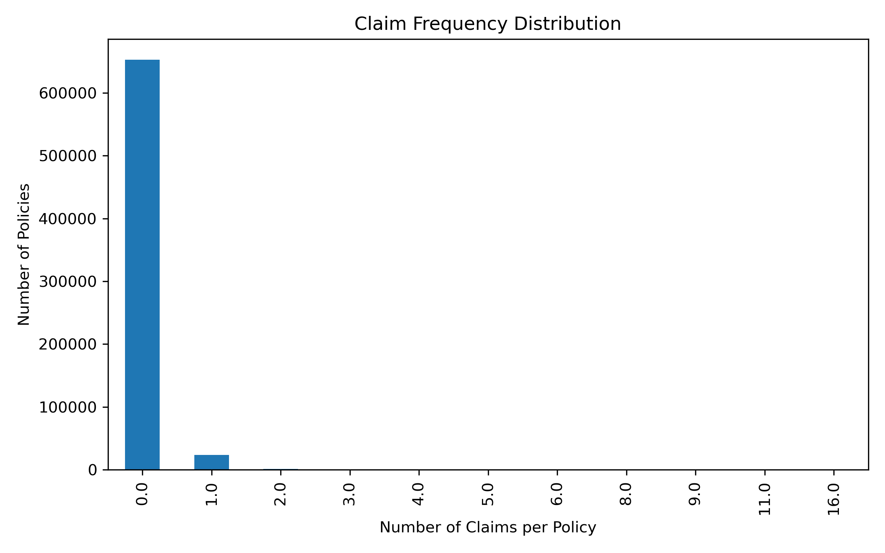
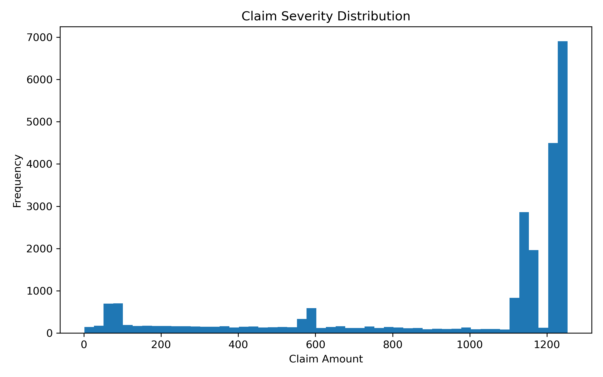
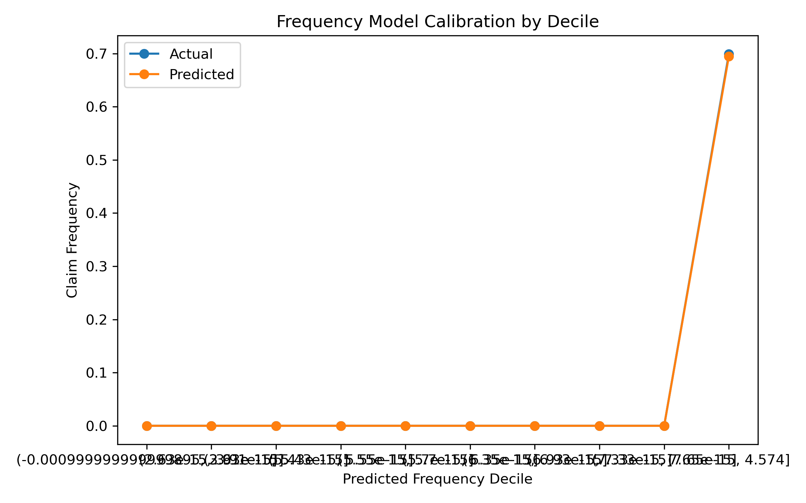
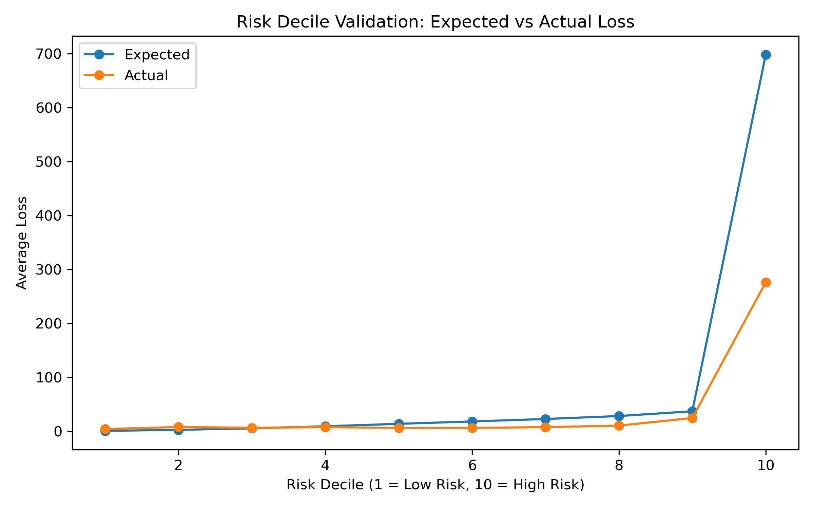

<h1>Insurance Risk Scoring using Frequency–Severity Modeling</h1>

<em>End-to-end insurance risk scoring pipeline using actuarial frequency–severity modeling.</em>

<h2>1. Business Problem</h2>

Motor insurance providers must quantify policy-level risk to support
<strong>underwriting, pricing, and portfolio risk segmentation</strong> decisions.
The objective of this project is to build an
<strong>interpretable policy-level insurance risk scoring pipeline</strong>
that estimates <strong>expected annual loss per policy</strong> using historical claims data.

The resulting risk scores enable insurers to:

<ul>
  <li>Differentiate high-risk vs low-risk policies</li>
  <li>Support pricing and underwriting decisions</li>
  <li>Perform portfolio-level risk monitoring and backtesting</li>
</ul>

<h2>2. Data Overview</h2>

The project uses motor insurance <strong>policy and claims data</strong>, including:

<ul>
  <li>Policy attributes (driver, vehicle, region)</li>
  <li>Exposure (policy duration)</li>
  <li>Individual claim records with claim amounts</li>
</ul>

Claims were <strong>aggregated at the policy level</strong> to construct:

<ul>
  <li><strong>Claim frequency</strong>: number of claims per unit exposure</li>
  <li><strong>Claim severity</strong>: total claim cost, conditional on at least one claim</li>
</ul>

Exposure-adjusted targets ensure comparability across policies with different coverage durations.

  
<strong>Note on Data Availability</strong> 
  Due to size constraints, raw datasets are not included in this repository.
  The data used in this project can be obtained from the original public source
  and placed in the <code>data/</code> directory to reproduce results.

<h2>3. Exploratory Analysis</h2>

<em>Highly skewed claim count distribution, validating the use of Poisson modeling for claim frequency.</em>

<em>Right-skewed claim severity distribution motivating log-scale severity modeling.</em>

<h2>4. Methodology</h2>

The modeling framework follows <strong>industry-standard actuarial frequency–severity decomposition</strong>.

<h3>Claim Frequency Modeling</h3>
<ul>
  <li><strong>Poisson Generalized Linear Model (GLM)</strong></li>
  <li>Target: claim count per policy</li>
  <li>Offset: <code>log(exposure)</code></li>
  <li>Purpose: estimate how often claims occur</li>
</ul>

Key assumptions such as exposure normalization and equidispersion were explicitly considered.

<em>Calibration of predicted vs actual claim frequency across deciles.</em>

<h3>Claim Severity Modeling</h3>
<ul>
  <li><strong>Log-linked regression</strong> on positive claim amounts</li>
  <li>Trained only on policies with at least one claim</li>
  <li>Target: total claim amount (conditional severity)</li>
  <li>Purpose: estimate expected claim cost when a claim occurs</li>
</ul>

This conditional approach avoids zero-inflation bias and aligns with actuarial best practices.

<h3>Risk Score Construction</h3>
<ul>
  <li><strong>Expected Annual Loss = Predicted Frequency × Predicted Severity</strong></li>
  <li>Expected losses normalized to a <strong>0–100 risk score</strong></li>
  <li>Policies grouped into <strong>Low / Medium / High</strong> risk bands</li>
</ul>

<em>Monotonic increase in realized losses across predicted risk deciles, confirming ranking effectiveness.</em>

<h2>5. Outputs</h2>

<h3>Business Output — <code>insurance_risk_scores.csv</code></h3>
<ul>
  <li>Policy ID</li>
  <li>Predicted claim frequency</li>
  <li>Predicted claim severity</li>
  <li>Expected annual loss</li>
  <li>Risk score (0–100)</li>
  <li>Risk band (Low / Medium / High)</li>
</ul>

Used directly for underwriting and pricing workflows.

<h3>Validation Output — <code>insurance_risk_validation.csv</code></h3>
<ul>
  <li>Expected vs actual losses</li>
  <li>Risk deciles</li>
  <li>Loss ratios by decile</li>
</ul>

Used for portfolio backtesting and model validation.

Column definitions for both output files are documented within the <code>outputs/</code> directory.

<h2>6. Key Insights</h2>
<ul>
  <li>Claim <strong>frequency</strong> is the dominant driver of total policy risk.</li>
  <li>Severity is strongly influenced by vehicle characteristics and regional factors.</li>
  <li>High-frequency, moderate-severity policies contribute disproportionately to portfolio loss volatility.</li>
  <li>Risk decile analysis shows clear monotonic separation between predicted risk and realized losses.</li>
</ul>

<h2>7. Model Validation</h2>

Model performance was evaluated using:

<ul>
  <li>Poisson deviance and calibration checks for frequency</li>
  <li>Error analysis and decile stability for severity</li>
  <li>Portfolio-level decile backtesting comparing expected vs actual losses</li>
</ul>

Directional alignment across deciles confirms the model’s
<strong>ranking effectiveness</strong>, which is critical for underwriting and pricing decisions.

<h2>8. Limitations</h2>
<ul>
  <li>Assumes historical claim patterns remain stable over time</li>
  <li>Does not explicitly model inflation or repair cost escalation</li>
  <li>Assumes claim independence and Poisson equidispersion</li>
  <li>Limited to available features; fraud indicators not included</li>
  <li>Results are specific to the geographic scope of the data</li>
</ul>

<h2>9. Tech Stack</h2>
<ul>
  <li><strong>Python</strong> (pandas, numpy)</li>
  <li><strong>Statsmodels</strong> (Poisson GLM, log-linked regression)</li>
  <li>Exposure-adjusted actuarial modeling</li>
  <li>Portfolio decile analysis and backtesting</li>
  <li>CSV-based production outputs</li>
</ul>

<h2>9.1 Reproducibility</h2>

To reproduce the results of this project:

<ol>
  <li>Install dependencies listed in <code>requirements.txt</code></li>
  <li>Download the original public dataset and place it in a local <code>data/</code> directory</li>
  <li>Run <code>INSURANCE_RISK_SCORING.ipynb</code> end to end</li>
</ol>

Raw datasets are intentionally excluded from version control due to size considerations.

<h2>10. Conclusion</h2>

This project demonstrates a <strong>production-style, interpretable insurance risk scoring pipeline</strong>
aligned with actuarial best practices.
By combining frequency–severity modeling with portfolio-level validation,
the resulting risk scores are suitable for
<strong>real-world underwriting, pricing, and risk management applications</strong>.

